# OPNsense Firewall Lab

## Project Overview

This project documents the deployment of OPNsense as a virtual firewall using VMware Workstation. The goal of the lab was to gain hands-on experience with firewall administration, routing, DHCP, DNS, and network segmentation while building and troubleshooting a secure virtual network environment.

## Goals

* Deploy OPNsense in VMware Workstation
* Configure WAN and LAN interfaces
* Configure DHCP and DNS services
* Implement and validate firewall rules
* Troubleshoot routing and connectivity issues
* Document lessons learned and solutions

## Lab Environment

* VMware Workstation Pro
* OPNsense
* Windows Host
* Ubuntu Client VM
* VMware VMnet8 WAN/NAT Network
* VMware VMnet1 LAN Network

## Skills Demonstrated

* Firewall Administration
* Routing Fundamentals
* DHCP Configuration
* DNS Configuration
* Network Segmentation
* Network Troubleshooting
* Virtualization
* VMware Workstation

---

## Final Working Environment

The completed lab successfully routed traffic between isolated LAN and WAN networks using OPNsense as the primary firewall. DHCP, DNS, routing, and firewall policies were configured and validated through connectivity testing and firewall log analysis.

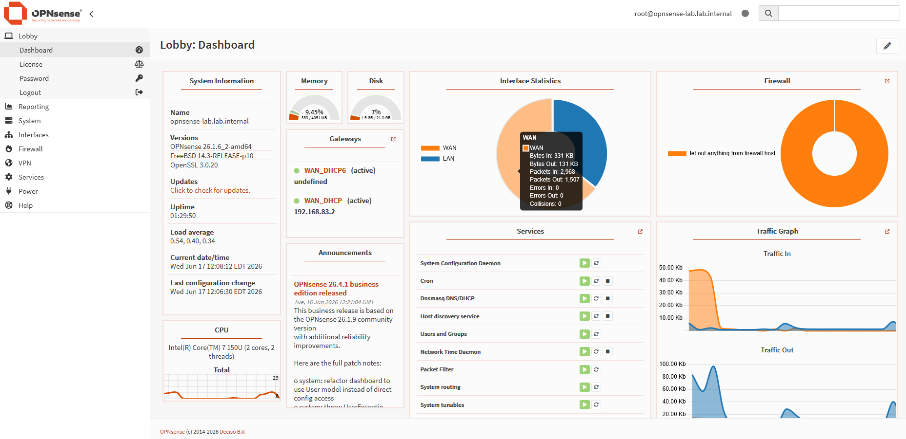

---

## Network Diagram

```text
             Internet
                 │
                 ▼
          VMware NAT
           VMnet8
                 │
                 ▼
    ┌────────────────────┐
    │      OPNsense      │
    │                    │
    │ WAN: 192.168.83.x  │
    │ LAN: 192.168.168.2 │
    └────────────────────┘
                 │
                 ▼
            VMnet1 LAN
                 │
                 ▼
    ┌────────────────────┐
    │   Ubuntu Client    │
    │ 192.168.168.128    │
    └────────────────────┘
```

---

## Initial Deployment

The firewall was deployed as a virtual machine with separate WAN and LAN interfaces. VMware NAT networking was used for WAN connectivity while a dedicated host-only network was used for the internal LAN segment.

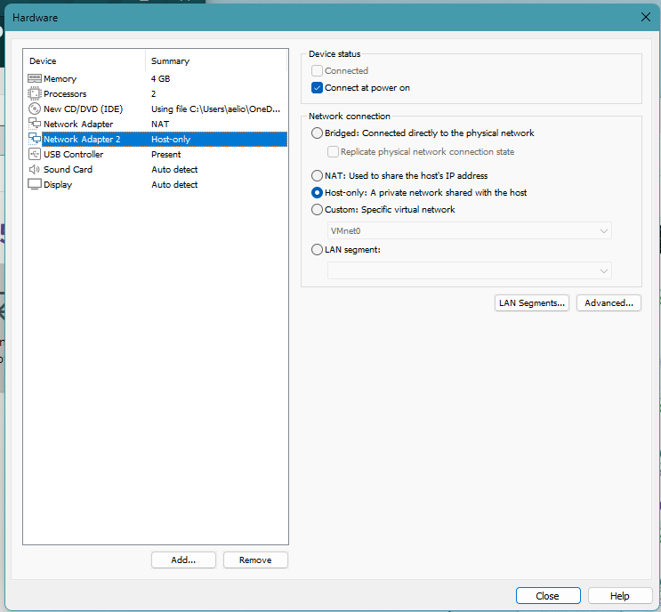

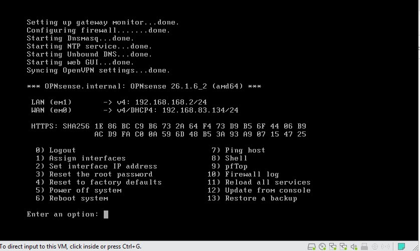

---

## Network Services Configuration

The LAN interface was configured with a dedicated subnet and DHCP services were deployed to automatically assign addresses to client systems. A DHCP scope was configured within the LAN subnet while avoiding conflicts with VMware-managed networking and infrastructure addresses.

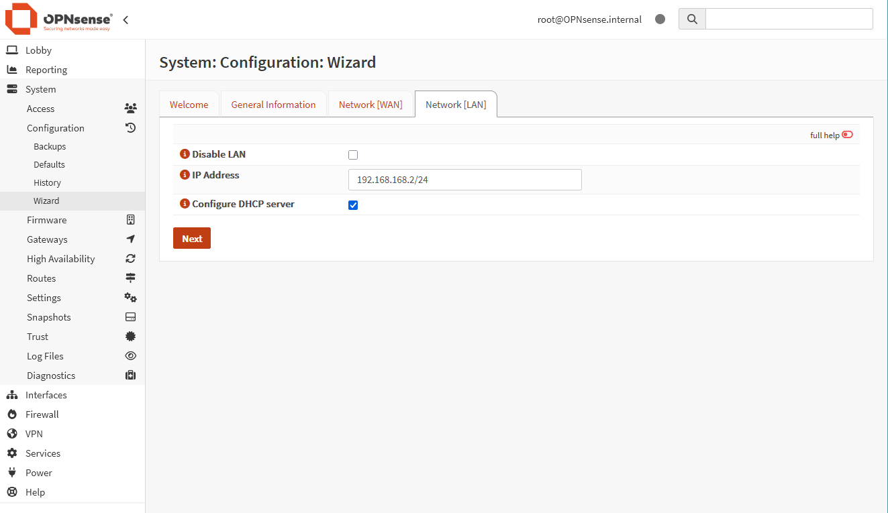

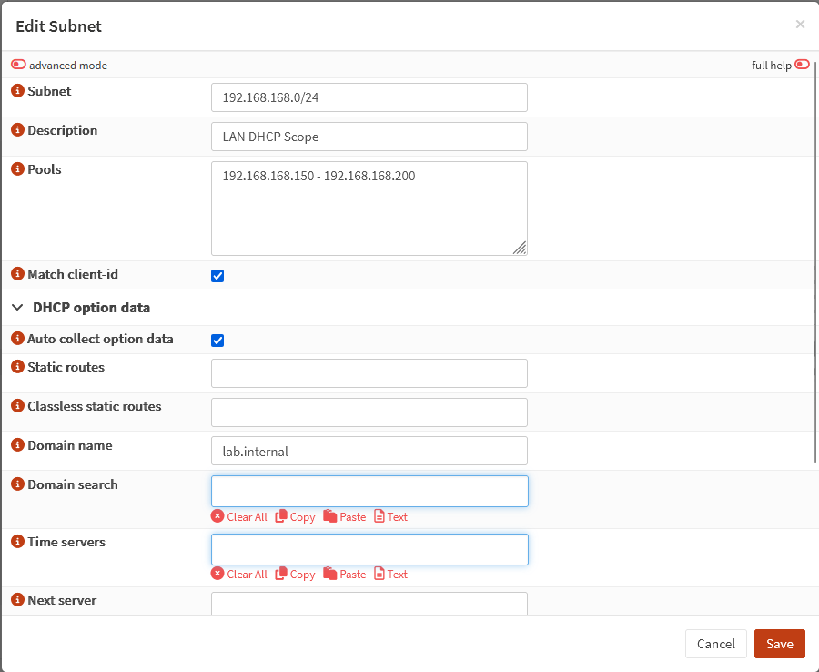

---

## Problem Encountered

Following deployment, the Ubuntu client was unable to reach external networks. Initial testing showed that internet-bound traffic could not leave the LAN segment.

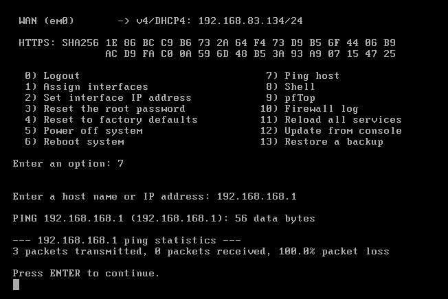

---

## Investigation

Troubleshooting focused on validating network connectivity, DHCP configuration, and client network settings.

Reviewing the client's network configuration revealed that an IP address had been assigned, but no default gateway was present. Without a valid gateway, traffic could not leave the local network segment.

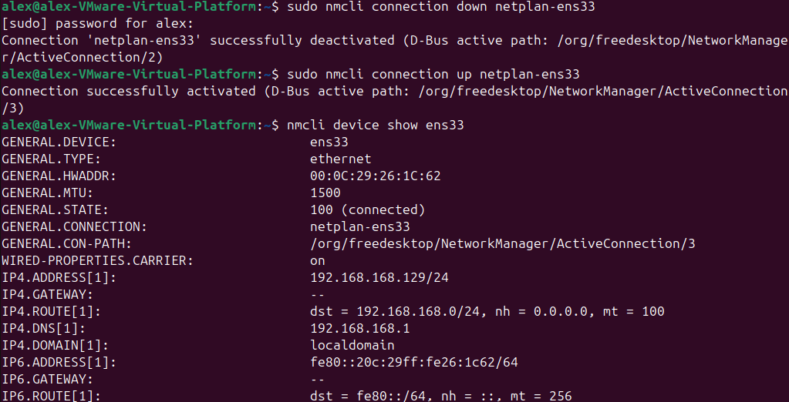

Additional investigation focused on VMware networking and DHCP configuration to determine why the client was not receiving complete network information.

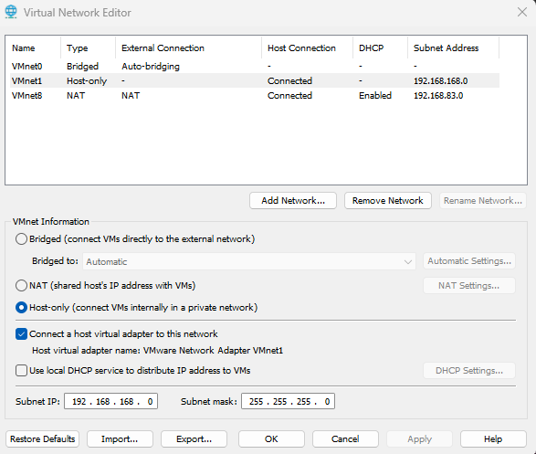
---

## Resolution

After correcting the network configuration, the Ubuntu client successfully received a valid gateway, DNS server, and domain information from OPNsense.

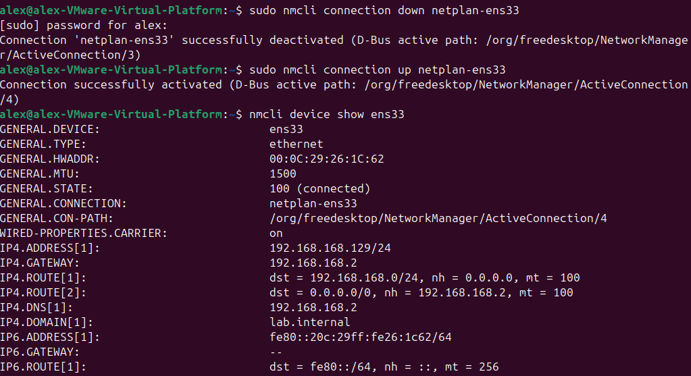

---

## Firewall Validation

A custom firewall rule was created to block DNS traffic to Google's public DNS server (8.8.8.8). Firewall logs confirmed that traffic was being inspected and filtered according to the configured policy.

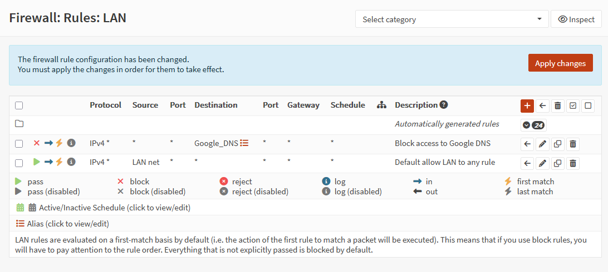


---

## Connectivity Validation

Final testing confirmed successful communication between the Ubuntu client, the OPNsense firewall, and external network resources.

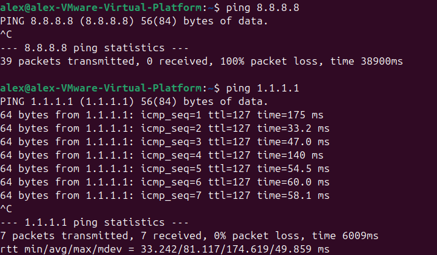

---

## Lessons Learned

* Proper interface assignment is critical for successful routing.
* DHCP configuration issues can appear as general connectivity failures.
* Missing default routes prevent hosts from reaching external networks.
* Firewall rules should always be validated through testing and log analysis.
* Structured troubleshooting helps isolate issues more efficiently than making configuration changes at random.

## Next Steps

* Implement VLAN segmentation
* Expand the lab with additional client systems
* Configure centralized logging
* Explore IDS/IPS functionality
* Integrate additional security monitoring tools
