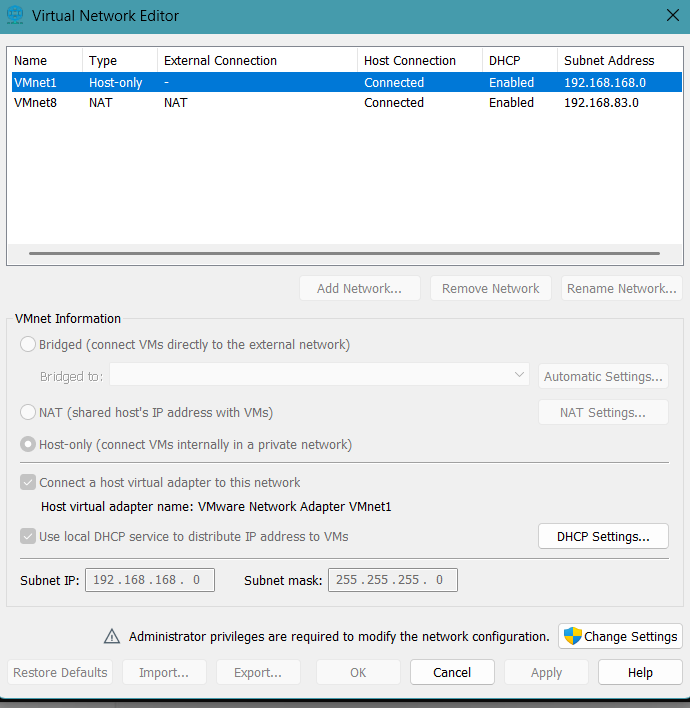
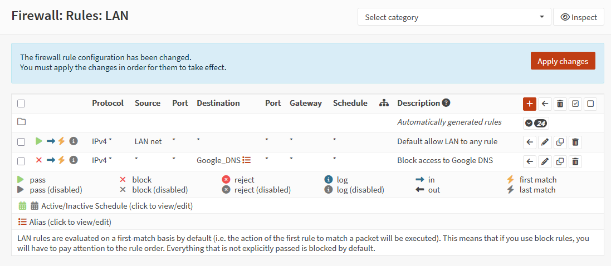

# OPNsense Firewall Lab

## Project Overview

This project documents the deployment of OPNsense as a virtual firewall using VMware Workstation. The goal of the lab is to gain hands-on experience with firewall administration, routing, NAT, and network segmentation while building a secure virtual network environment.

## Goals

- Deploy OPNsense in VMware Workstation
- Configure WAN and LAN interfaces
- Implement firewall rules
- Configure Network Address Translation (NAT)
- Validate network connectivity
- Explore network segmentation concepts
- Document troubleshooting and lessons learned

## Lab Environment

- VMware Workstation Pro
- OPNsense
- Windows Host
- Virtual WAN Network
- Virtual LAN Network

## What I Built

I deployed OPNsense as a virtual firewall and configured separate WAN and LAN interfaces within VMware Workstation. The lab provided hands-on experience with firewall rule management, routing, NAT configuration, and troubleshooting network connectivity in a virtualized environment.

## Skills Demonstrated

- Firewall Administration
- Routing Fundamentals
- NAT Configuration
- Network Segmentation
- Network Troubleshooting
- Virtualization
- VMware Workstation

## Final Working Environment
  

## Network Diagram
_To be completed._

## VMware Network Diagram
  

## Interface Configuration
  
  

## Firewall Validation
  
  
  
## Next Steps

- Configure additional firewall rules
- Explore VLAN segmentation
- Implement logging and monitoring
- Expand the lab environment with additional virtual hosts
